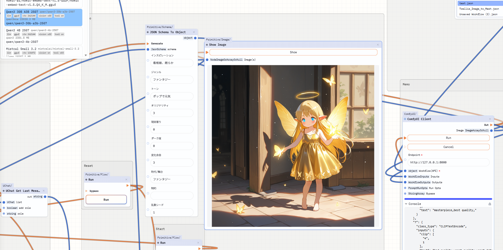

## Kavukiai

Kavukiai(仮)は、主にローカルでAIを繋げて楽しむことができる、ノードUIのデスクトップツールです。

ノードをつなげて、AIワークフローを作ることができます。

## 特徴

- KavukiaiはComfyUI＋各種プラグイン、Dify、n8n、そしてバイブコーディング(ChatGPTなど)等等に比べて劣ります。まずはそれらのツールで目的を達成できるかをご確認のうえ、Kavukiaiで試したいアイデアが浮かんだときにお使いください。
- Kavukiaiはノードエディタであり、LM StuidoやComfyUIを呼び出すノードがあり、ノードを組み合わせてワークフローを作成することができます。
- どういうワークフローが組めるかは、[Workflow.md](doc/workflow.md)ドキュメントにまとまっています。
- ノードに実行ボタンが付属していて、処理の流れも変えることができます。
- 実験的に作ったα版です。基本的な機能(LLMのごく簡単な呼び出し、生成画像を表示する)のみです。
- ワークフローはJSONまたはPNGで保存できます。またそれらをドラッグアンドドロップで読み込むことができます
- Windows版のみ。

## 履歴
2025/10/11 ver 5.0.0公開

## インストール方法

### 1. 前準備

[LM Studio](https://lmstudio.ai/)と[Comfy UI Desktop](https://www.comfy.org/)をインストールして、かつ適当なモデルをダウンロードしてください。

モデルは例えば以下等です
- qwen/qwen3-30b-a3b-2507
- WAI-NSFW-illustrious-SDXL v15.0

### 2. ダウンロード、解凍、起動
Releaseページから、exeファイルをダウンロードして実行します。
(現在証明書などがないので、警告がでます)

（注意: 環境毎のビルドがありますが、Windows以外は未確認です。）

## 基本操作
- ノードはマウスで移動できます。
- コネクション(線)は、処理の流れ(push)のオレンジとデータの流れ(pull)の青色があります。型の合うものにつなぐことができます。
- 右クリックメニューからノードの作成
- マウス中ボタンで画面移動
- ctrl + c , ctrl + v でノードのコピーとペースト。

## 既知の問題(たぶん対処予定)
- group機能の挙動が微妙。
- ComfyUIのエラーが分かりづらい。
- ローディングアニメーションがない。
- JsonSchemaNodeがネストした形を定義できない。つまりkey valueの形にしか設定できない。
- コネクションを離したときにメニューがでるだけ。
- Windows版のみ動作確認
- ループ処理は出来るんだけど、青(データ)の方が基本できないので、実質面倒でできない。
- なんかセーブの挙動が……デザインが……

## 作成予定
- 変数ノード
- 画像をLLM等のinputにする。

## ノードの追加方法
フォークして、クローンして、AIにでも書いてもらって、プッシュして、プルリクする……

## 意見・感想等
Issuesへ

## LICENSE
MIT
[LICENSE.md](LICENSE.md)

## ソフト内で使っているプロンプト
ネット上で見かけた権利がCC BY相当と思われるプロンプトを取り込んでいます。以下に作者と掲載元を記述します。

[カガミカミ水鏡](https://potofu.me/kagamikami):[小説企画＋執筆用ゴールシークプロンプト](https://github.com/kgmkm/goalseek_ad)

[robo-robo](https://note.com/robo_robo_9):[イメージチャットシステムプロンプト](https://note.com/robo_robo_9/n/nef5345f312d7)

[ぬるぽらぼ](https://x.com/NullpoLab):[インタラクティブテキストアドベンチャーゲームプロンプト](https://note.com/nullpolab/n/n738c84e2110e)

