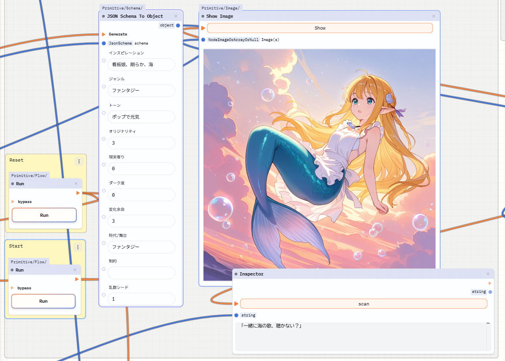

[日本語](README.md) | [English](README.en.md) | [简体中文](README.zh-CN.md)

**最后更新：** 2025-10-11

## Kavukiai

Kavukiai（暂定名称）是一款基于节点界面的桌面工具，可以把本地的各类 AI 服务串联起来进行尝试与玩耍。

通过连接节点即可搭建属于你的 AI 工作流。

## 特性

- Kavukiai 是一个节点编辑器，内置可调用 LM Studio 与 ComfyUI 的节点，可以按需组合节点构建工作流。
- 可构建的工作流示例整理在 [Workflow.md](doc/workflow.md) 中。
- 每个节点都带有执行按钮，可以切换处理流程。
- 目前是实验性质的 α 版，仅包含基础功能（简单调用 LLM、展示生成图像）。
- 工作流既可以保存为 JSON，也可以保存为 PNG，并支持拖放导入。
- 目前仅提供 Windows 版。

> ⚠️  与 ComfyUI（及其插件）、Dify、n8n 以及 Vibe Coding（ChatGPT 等工具）相比，Kavukiai 的功能还较弱。建议优先确认这些工具能否满足需求，若有想在 Kavukiai 上试验的创意，再回到本工具。

## 更新记录
2025-10-11 发布 v5.0.1

## 安装

### 1. 事前准备

请安装 [LM Studio](https://lmstudio.ai/) 与 [Comfy UI Desktop](https://www.comfy.org/)，并下载合适的模型。

模型示例：
- qwen/qwen3-30b-a3b-2507
- WAI-NSFW-illustrious-SDXL v15.0

### 2. 下载、解压、启动

访问 [Releases 页面](https://github.com/ahehead/Kavukiai/releases/)，打开最新版本页面，下载 `.exe` 并运行。  
（由于缺少签名证书，目前会弹出安全警告。）

注意：虽提供多个平台的构建，但只有 Windows 版经过确认。

### 已验证环境
- Windows 11
- GPU NVIDIA GeForce RTX 3060 Ti（8 GB VRAM）
- 在 LM Studio 0.3.30 / ComfyUI Desktop v0.3.63 上完成验证

## 基本操作
- 使用鼠标拖动节点即可移动。
- 橙色连线表示执行流（push），蓝色连线表示数据流（pull）；请连接类型匹配的端口。
- 右键菜单可新建节点。
- 使用鼠标中键拖动画布。
- 通过 `Ctrl + C` / `Ctrl + V` 复制粘贴节点。

## 已知问题（计划修复）
- ComfyUI 的错误信息难以理解。
- 暂无加载动画。
- `JsonSchemaNode` 无法定义嵌套结构，只能设置为简单的键值对形态。
- 断开连接时只会弹出菜单。
- 仅确认 Windows 版可用。
- 虽然理论上可以做循环，但蓝色（数据）连线大多不可用，实际几乎无法操作。
- 保存行为比较奇怪，整体体验仍需改进。

## 开发计划
- 变量节点
- 将图像作为 LLM 等组件的输入。

## 添加节点
Fork 仓库，克隆到本地，让 AI 协助你编写，然后推送并提交 Pull Request……

## 意见反馈
欢迎在 GitHub Issues 提出。

## 许可证
MIT  
[LICENSE.md](LICENSE.md)

## 应用内打包的提示词
可以从应用内模板中调用提示词。  
目前收录了一些在网上找到、确认应为 CC BY 许可的提示词。  
作者与出处如下：

[カガミカミ水鏡](https://potofu.me/kagamikami)：[小説企画＋執筆用ゴールシークプロンプト](https://github.com/kgmkm/goalseek_ad)

[robo-robo](https://note.com/robo_robo_9)：[イメージチャットシステムプロンプト](https://note.com/robo_robo_9/n/nef5345f312d7)

[ぬるぽらぼ](https://x.com/NullpoLab)：[インタラクティブテキストアドベンチャーゲームプロンプト](https://note.com/nullpolab/n/n738c84e2110e)
