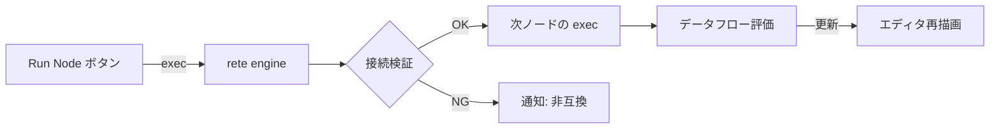
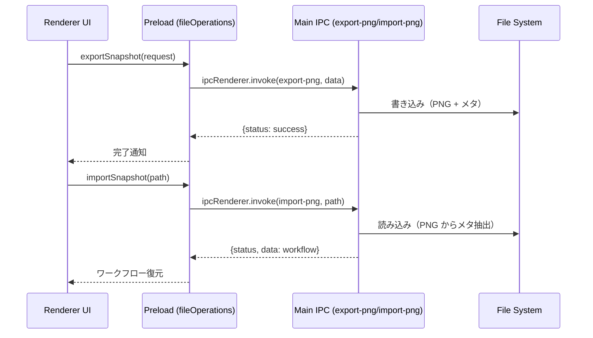
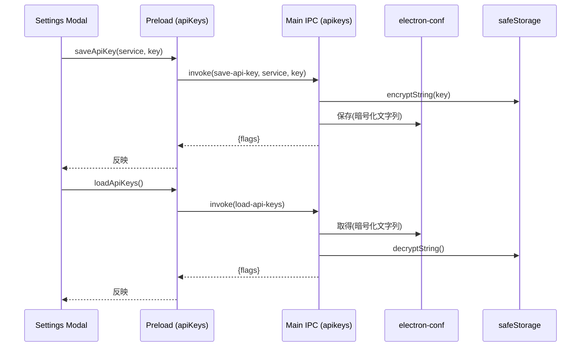
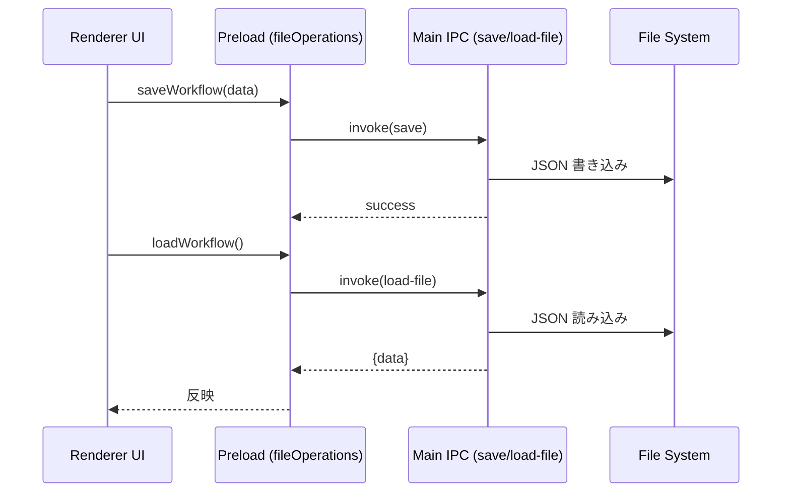

# 処理フロー（Mermaid）

処理の順番や主要コンポーネント間の流れを Mermaid 記法でまとめます。

## ノード実行フロー（概略）

```mermaid
flowchart LR
  A[Run Node ボタン] -->|exec| B[rete engine]
  B --> C{接続検証}
  C -- OK --> D[次ノードの exec]
  C -- NG --> E[通知: 非互換]
  D --> F[データフロー評価]
  F -->|更新| G[エディタ再描画]
```

## PNG スナップショット出力/入力

```mermaid
sequenceDiagram
  participant UI as Renderer UI
  participant PRE as Preload (fileOperations)
  participant IPC as Main IPC (export-png/import-png)
  participant FS as File System

  UI->>PRE: exportSnapshot(request)
  PRE->>IPC: ipcRenderer.invoke(export-png, data)
  IPC->>FS: 書き込み（PNG + メタ）
  IPC-->>PRE: {status: success}
  PRE-->>UI: 完了通知

  UI->>PRE: importSnapshot(path)
  PRE->>IPC: ipcRenderer.invoke(import-png, path)
  IPC->>FS: 読み込み（PNG からメタ抽出）
  IPC-->>PRE: {status, data: workflow}
  PRE-->>UI: ワークフロー復元
```

## API キー保存/読み込み

```mermaid
sequenceDiagram
  participant UI as Settings Modal
  participant PRE as Preload (apiKeys)
  participant IPC as Main IPC (apikeys)
  participant CONF as electron-conf
  participant SAFE as safeStorage

  UI->>PRE: saveApiKey(service, key)
  PRE->>IPC: invoke(save-api-key, service, key)
  IPC->>SAFE: encryptString(key)
  IPC->>CONF: 保存(暗号化文字列)
  IPC-->>PRE: {flags}
  PRE-->>UI: 反映

  UI->>PRE: loadApiKeys()
  PRE->>IPC: invoke(load-api-keys)
  IPC->>CONF: 取得(暗号化文字列)
  IPC->>SAFE: decryptString()
  IPC-->>PRE: {flags}
  PRE-->>UI: 反映
```

## JSON ファイル保存/読み込み

```mermaid
sequenceDiagram
  participant UI as Renderer UI
  participant PRE as Preload (fileOperations)
  participant IPC as Main IPC (save/load-file)
  participant FS as File System

  UI->>PRE: saveWorkflow(data)
  PRE->>IPC: invoke(save)
  IPC->>FS: JSON 書き込み
  IPC-->>PRE: success

  UI->>PRE: loadWorkflow()
  PRE->>IPC: invoke(load-file)
  IPC->>FS: JSON 読み込み
  IPC-->>PRE: {data}
  PRE-->>UI: 反映
```

