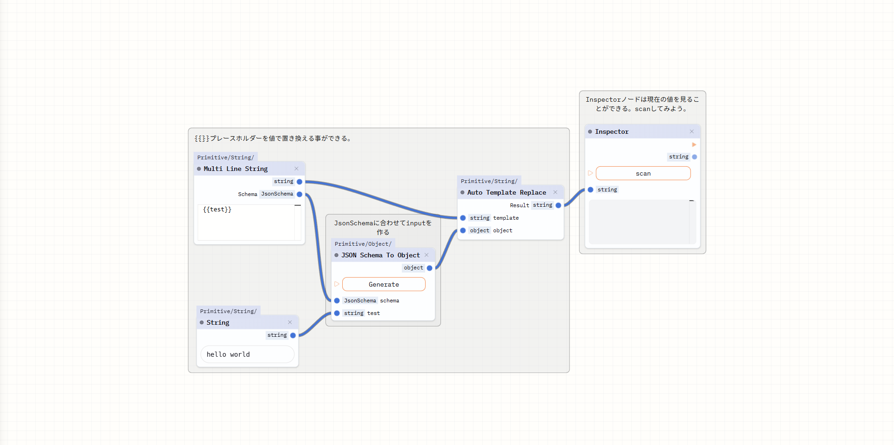
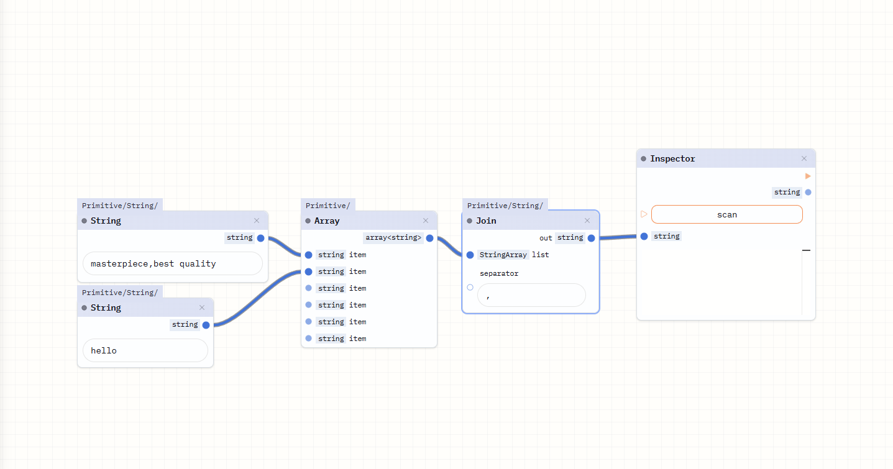
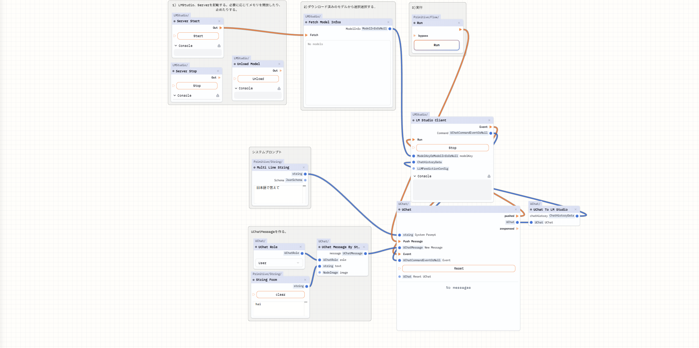
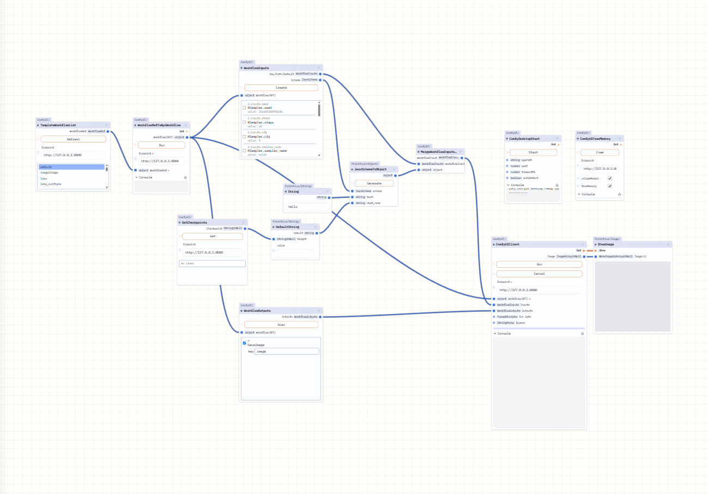
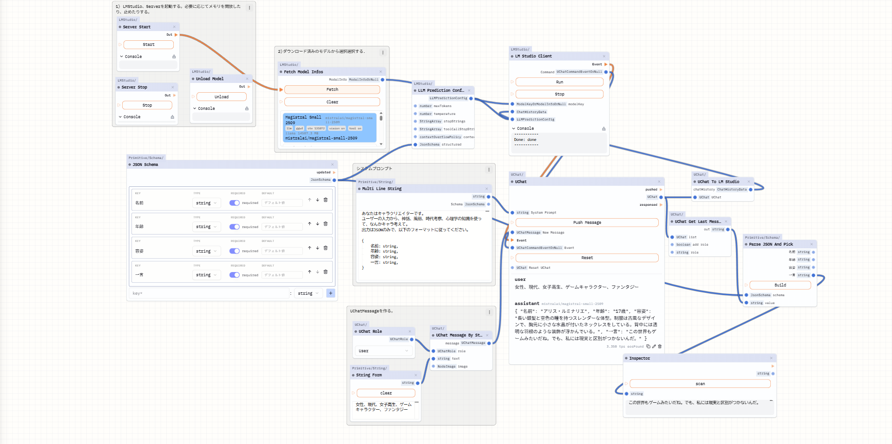

## ワークフローとその説明

作れるワークフロー例です。
ここにあるワークフローはドラッグアンドドロップしたり、Kavukiai内のmenuのtempletesから読み込むことができます。

### String Template

文字列に値を埋め込む例。

MultiLineNode
- stringを返す。
- {{test}}というプレースホルダを文中で使うと、{test : { type : string}} という感じのJsonSchemaを作り返すことができます。

JsonSchema to Object Node
- JsonSchemaをinputに変えるノード、

Auto Template Replace Node
- {{}}というプレースホルダを使っているstringに、objectを埋め込むノードです。

### String Join

stringをlistにして、joinでくっつける例です。

### LM Studio

LM Studioを使う例です。

LM Studioを起動、停止、メモリを解放するノードなどがあります。

UChatノードは、Chat用の履歴を構成するノードです。
ここにUChat Messageをリストにして、LM Studioに渡しています。

### ComfyUI

ComfyUIを使う例です。

ComfyUIのワークフローを読み込んで、ワークフローの一部を置き換えて、ComfyUIに投げるようになっています。

### JsonSchema

JSON SchemaでLLMの返答を固定して、値を取り出す例
